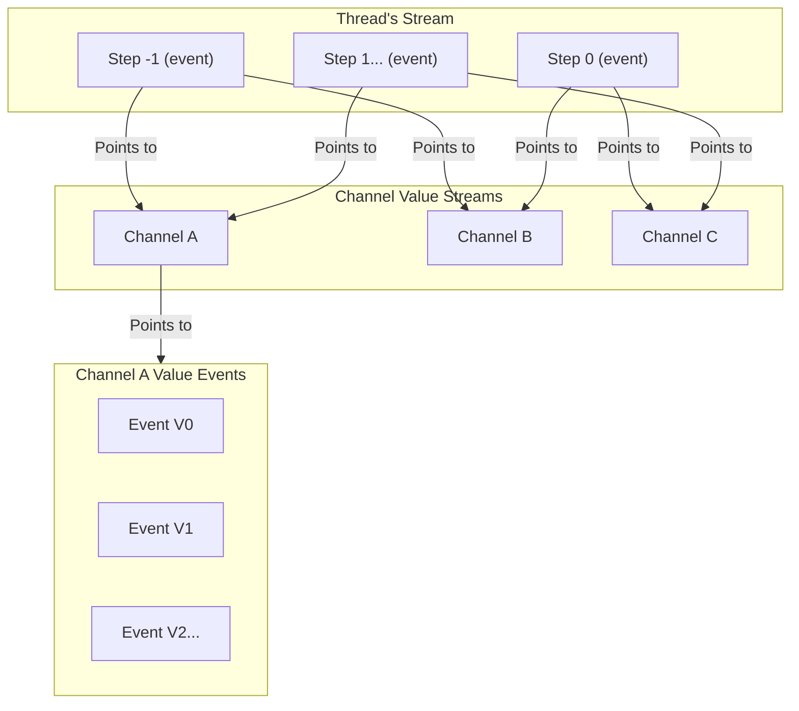

# LangGraph Checkpoint KurrentDB: Experimental

KurrentDB checkpoint implementation for LangGraph. 
This is an experimental release and not be ready to be used in production, yet.
This project is intended to show that KurrentDB has the right native capabilities to be used as a checkpointing mechanism for LangGraph.

If you would like to see a production version of the checkpointer, feel free to upvote this issue: https://github.com/kurrent-io/langgraph-checkpoint-kurrentdb/issues/3

## Overview

LangGraph is an orchestration framework for complex agentic systems.
This package provides a checkpointing mechanism for LangGraph using KurrentDB.
We use KurrentDB's event sourcing capabilities to store the state of the LangGraph execution.
The versioning of state is mapped to KurrentDB's native event versioning and every the channel value is kept into its own stream.
Every step in the thread then only has a pointer (channel value name and version) to the actual channel value (event). 
(Original Langgraph's channel versioning is also kept)



## Installation

```bash
pip install langgraph-checkpoint-kurrentdb
```

Or using Poetry:

```bash
poetry add langgraph-checkpoint-kurrentdb
```

## KurrentDB
- $Streams and $by_category System projections need to enabled

## Usage

Setting up the KurrentDB checkpointer for your LangGraph:

```python
from kurrentdbclient import KurrentDBClient
from langgraph.graph import StateGraph
from typing import Dict

from langgraph_checkpoint_kurrentdb import KurrentDBSaver

# wait a random amount of time
import random
import time
def random_delay(func):
    def wrapper(*args, **kwargs):
        time.sleep(random.randint(1, 3))
        return func(*args, **kwargs)  # Call the original function
    return wrapper

# Simulated weather function
@random_delay
def get_weather(location: str) -> Dict:
    # Replace with real API call
    weather_data = {
        "Luxembourg": {"temp_c": 8, "condition": "Rainy"},
        "Barcelona": {"temp_c": 22, "condition": "Sunny"},
    }
    return weather_data.get(location, {"temp_c": 15, "condition": "Cloudy"})

# Decision logic
@random_delay
def clothing_advice(weather: Dict) -> str:
    temp = weather["temp_c"]
    condition = weather["condition"]

    if temp < 10:
        return f"It's {condition} and cold. Wear a coat and bring an umbrella."
    elif temp < 20:
        return f"It's {condition} and cool. Wear a light jacket."
    else:
        return f"It's {condition} and warm. Shorts and t-shirt are fine."

# Simulated logger
@random_delay
def log_advice(advice: str) -> str:
    print(f"[LOG] Advice: {advice}")
    return advice
#Establish connection to KurrentDB
kdbclient = KurrentDBClient(uri="esdb://localhost:2113?Tls=false")
memory_saver = KurrentDBSaver(client=kdbclient)

# Building the graph
builder = StateGraph(str)  # Initial state is a location name (str)
builder.add_node("get_weather", get_weather)
builder.add_node("clothing_advice", clothing_advice)
builder.add_node("log_advice", log_advice)

# Setting up flow
builder.set_entry_point("get_weather")
builder.add_edge("get_weather", "clothing_advice")
builder.add_edge("clothing_advice", "log_advice")
builder.set_finish_point("log_advice")

config = {"configurable": {"thread_id": "weather-graph"}}
# Compile and run
graph = builder.compile(checkpointer=memory_saver)
result = graph.invoke("Luxembourg", config)

# Export to OTEL
# docker run --rm --name jaeger   -p 16686:16686   -p 4317:4317   -p 4318:4318   -p 5778:5778   -p 9411:9411   jaegertracing/jaeger:2.5.0
# pip install opentelemetry-exporter-otlp
from opentelemetry import trace
from opentelemetry.sdk.trace.export import BatchSpanProcessor
from opentelemetry.exporter.otlp.proto.grpc.trace_exporter import OTLPSpanExporter
otlp_exporter = OTLPSpanExporter(endpoint="http://localhost:4317", insecure=True)
span_processor = BatchSpanProcessor(otlp_exporter)
memory_saver.export_trace(thread_id="weather-graph", span_processor=span_processor, trace=trace)
```

## Tests
```bash
poetry run pytest --cov --cov-report=term-missing
```
